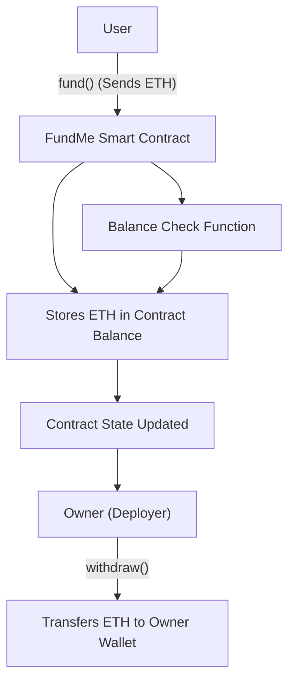

# 💸 Fund Me (Web3 Crowdfunding Smart Contract)


---

## 🚀 Overview

**Fund Me** is a decentralized crowdfunding smart contract built in Solidity using Foundry.

It allows users to:
- Deposit ETH into a smart contract
- Track contract balance
- Allow only the owner to withdraw funds

This project demonstrates the **core idea of Web3 crowdfunding**, removing intermediaries and enabling trustless capital flow.

---

## 🧠 Architecture

## Flow Diagram


---

## ✨ Features

- 💰 Deposit ETH into the contract  
- 📊 View contract balance  
- 🔐 Owner-only withdrawal  
- ⚙️ Automated workflows via Makefile  
- 🌐 Deployable on:
  - Local blockchain (Anvil)
  - Ethereum Sepolia testnet
  - ZKsync (optional)

---

## 🛠️ Tech Stack

- Solidity (Smart Contracts)  
- Foundry (Development Framework)
- Anvil (Local Blockchain)
- Makefile (Automation)
- Ethereum / Sepolia / ZKsync

---

## 📦 Requirements

- Git  
- Foundry  
- Basic Solidity knowledge  

### Install Foundry

```bash
curl -L https://foundry.paradigm.xyz | bash 
foundryup
```

---

## ⚙️ Installation

Clone the repository and install dependencies:

```bash
git clone https://github.com/your-username/fund-me.git  
```
```bash
cd fund-me
```
```bash  
make install
```  

If dependencies break:

```bash
make remove
```
```bash
make install
```  

---

## 🔐 Environment Setup

Create a `.env` file in the root directory:

```
SEPOLIA_RPC=your_rpc_url  
MAINNET_RPC=your_rpc_url  
ETHERSCAN_API_KEY=your_api_key  
PRIVATE_KEY=your_private_key  
```

⚠️ Never use real wallets or expose private keys.

---

## ▶️ Usage

### Start local blockchain
```
anvil  
```
### Deploy locally
```
make deploy  
```
---

### Deploy to Sepolia

Requirements:
- Sepolia ETH  
- `.env` configured  

```bash
make deploy-sepolia  
```
---

### 🧪 Testing
```bash
forge test  
```
For verbose output:
```bash
forge test -vvv  
```
---

## 📁 Project Structure
```
fund-me/  
│── src/       # Smart contracts  
│── test/      # Tests  
│── script/    # Deployment scripts  
│── lib/       # Dependencies  
│── Makefile   # Automation commands  
```
---

## ⚠️ Notes & Limitations

- Educational project  
- No frontend  
- Minimal functionality  
- CLI-based interaction  

---

## 🧠 What I Learned

- Writing production-style Solidity contracts
- Using Foundry for testing + scripting
- Automating workflows with Makefile
- Multi-network deployment (local + testnet)
- Understanding reentrancy risk and mitigation
- Structuring real-world Web3 projects

## 🔐 Security Model

- Only contract owner can withdraw funds
- State updates happen before external calls (prevents reentrancy)
- No external dependencies in core logic
- Designed for educational safety only
  
---

## ⚠️ Important Notes

- This is an educational project
- Do NOT use with real funds
- No audit has been performed
- Use test networks only

---

## 🚀 Future Improvements

- Add frontend (React / Web3 UI)  
- Improve security patterns  
- Track contributors  
- Add withdrawal limits  
- Gas optimizations  

---

## 🤝 Contributing

1. Fork repository  
2. Create a branch  
3. Make changes  
4. Open a pull request  

---

## 📜 License

MIT License  

---